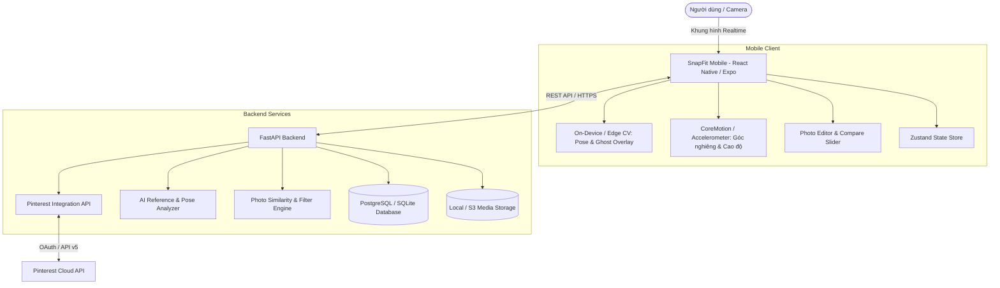

# Kiến Trúc Hệ Thống SnapFit (System Architecture)

SnapFit là giải pháp hỗ trợ chụp ảnh thông minh dựa trên AI & Computer Vision đa nền tảng (iOS & Android).

---

## 1. Thành phần kiến trúc

### 1.1. Mobile Application (`mobile/`)
- **Framework**: React Native with **Expo SDK 57** (Expo Router, TypeScript).
- **Core Modules**:
  - `expo-camera`: Tích hợp camera chụp ảnh độ phân giải cao, hỗ trợ chuyển đổi camera trước/sau, flash mode.
  - `Ghost Overlay & Skeleton Renderer`: Vẽ khung xương tư thế và bóng mờ của ảnh tham khảo trực tiếp trên khung hình camera.
  - `Sensor Guidance`: Đọc dữ liệu con quay hồi chuyển (gyroscope) và gia tốc kế (accelerometer) để hướng dẫn độ nghiêng (pitch) và độ xoay (roll) của thiết bị.
  - `Photo Comparison & Editor`: Chỉnh sửa màu sắc cơ bản và thanh trượt so sánh trước/sau (Split View Slider) giữa ảnh chụp và reference.
  - `Zustand State Management`: Quản lý reference đang chọn, cấu hình camera, feedback realtime và bộ sưu tập ảnh đã chụp.

### 1.2. Backend REST API (`backend/`)
- **Framework**: Python **FastAPI** (hiệu năng cao, async/await native, tự sinh tài liệu OpenAPI Swagger UI tại `/docs`).
- **Core Modules**:
  - `Pinterest Integration`: Tìm kiếm ảnh cảm hứng theo từ khóa và chuyên mục ảnh (Chân dung, OOTD, Cặp đôi, Nhóm bạn, Quán Cafe, Phong cảnh).
  - `AI Reference Analyzer`: Phân tích ảnh mẫu và trích xuất:
    - 17 điểm mốc tư thế cơ thể (COCO Keypoints standard).
    - Quy tắc bố cục (Rule of Thirds, điểm mạnh power points, đường chân trời).
    - Hướng nguồn sáng chính và bảng màu thẩm mỹ (Aesthetic Color Palette).
    - Góc máy đề xuất (cận cảnh, trung cảnh, toàn thân, góc thấp / eye-level / góc cao).
  - `Realtime Guidance Evaluator`: Thuật toán so khớp tư thế và đưa ra câu nhắc giọng nói / chữ (Tiếng Việt) giúp người chụp tự tin điều chỉnh.
  - `Photo Scoring & Comparison`: Đánh giá mức độ tương thích sau khi chụp (độ khớp tư thế, bố cục, màu sắc).

### 1.3. Cơ sở dữ liệu & Lưu trữ
- **Database**: SQLite (cho môi trường phát triển cục bộ) và PostgreSQL (cho Production).
- **Storage**: Lưu trữ ảnh gốc và ảnh đã qua xử lý trên thư mục đĩa cục bộ `/uploads` hoặc Amazon S3 / Cloudinary.
